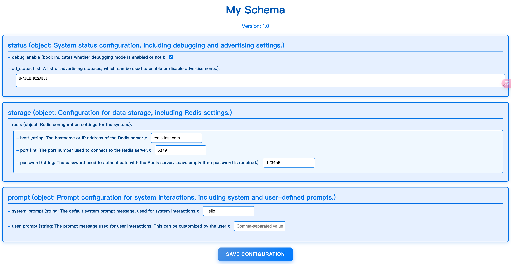

# Configuration Management Demo

This is a demo project that allows you to transform configuration files from Nacos into a more user-friendly format for easier modification and display. The demo simplifies managing and viewing configuration data by presenting it in a more structured way.

## Features

1. **Load and Update Configuration Files**  
   The demo can load configuration files from a Nacos server and update them with new values.
   
2. **Support for JSON and YAML Formats** (YAML support coming soon)  
   The tool currently supports JSON for configuration files, with plans to add support for YAML in the future.

3. **Easy Configuration Viewing and Modification**  
   It provides an interface to view and update configuration settings in a more intuitive format.

## Screenshots

Here’s a preview of how the interface looks when interacting with the tool:



## Installation

To use this demo, ensure you have Python 3.x installed. Follow the steps below to set up the environment:

### 1. Clone the repository

```bash
git clone git@github.com:nightosong/naive_schema_demo.git
cd naive_schema_demo
```

### 2. Install dependencies

You can install the required dependencies using `pip`:

```bash
pip install -r requirements.txt
```

## Configuretion

The configuration file format is based on a JSON structure, as shown in the example provided in `docs/example.json`. You can use this as a template to create or modify your own configuration files.

## Usage

To run the demo, use the following command with the appropriate arguments:

```bash
python3 main.py [arguments]
```

### Arguments:
- `--address`: The address to run the application on (default: `0.0.0.0` for all network interfaces).
- `--env`: The environment configuration (e.g., `local`, `test`, `prod`).
- `--port`: The port number on which the application will run (default: `8000`).
- `--nacos_addr`: The Nacos server address to fetch the configuration from.
- `--nacos_group`: The Nacos group (specific configuration set) to fetch.
- `--nacos_data_id`: The Nacos data ID (specific configuration set) to fetch.

### Example Command:

```bash
python3 main.py --address=0.0.0.0 --env=local --port=8000 --nacos_addr=nacos.example.com --nacos_data_id=config-demo
```

## Features in Development
- **YAML Support**: YAML format support will be added in a future update.
- **Real-time Updates**: Ability to push updates to the Nacos server and keep configurations synchronized.

## Contributing

Welcome contributions to improve this demo. To contribute:
1. Fork the repository.
2. Create a new branch for your feature or bug fix.
3. Submit a pull request with a description of your changes.

